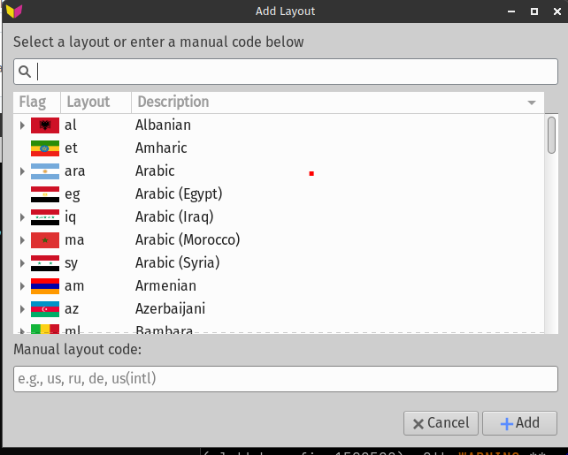
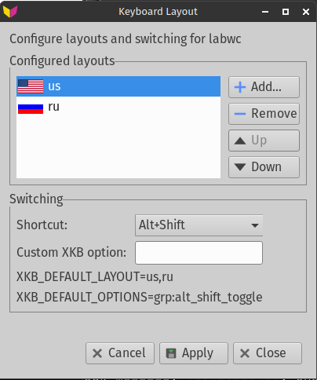

# wl-kbd-config

`wl-kbd-config` — GTK3-утилита для настройки раскладок клавиатуры и переключения раскладок в Wayland-сессиях.

Изначально проект был привязан к `labwc`, но сейчас поддерживает несколько Wayland WM:

- labwc
- sway
- wayfire
- river
- hyprland

## Что умеет

- редактировать список настроенных раскладок
- менять порядок раскладок
- выбирать готовое сочетание переключения
- задавать пользовательскую XKB-опцию
- показывать итоговые `XKB_DEFAULT_LAYOUT` и `XKB_DEFAULT_OPTIONS`
- применять настройки напрямую в `labwc` через `~/.config/labwc/environment`
- применять настройки в конфиги поддерживаемых WM с автоматическим созданием backup

## Снимки окна

Диалог добавления раскладок:



Секция переключения и предпросмотра:



## Текущее поведение

- В верхней строке показывается обнаруженный WM.
- В окне оставлены только редактируемые секции без лишнего дубляжа.
- Строки preview можно выделять и копировать.
- `Отмена` восстанавливает состояние на момент открытия окна.
- `Применить` не закрывает окно.
- `Закрыть` закрывает окно.

## Backup и миграция

Перед изменением конфигурации поддерживаемого WM `wl-kbd-config` создаёт backup в:

```text
~/.config/wl-kbd-config/backups/
```

Если существует старый каталог backup от `labwc-kbd`, приложение по возможности переносит его в новый путь.

Для управляемых блоков в конфиге теперь используется:

```text
# BEGIN wl-kbd-config
...
# END wl-kbd-config
```

Старые блоки `labwc-kbd` при записи автоматически удаляются.

## Сборка

```bash
meson setup build --prefix=/usr
meson compile -C build
```

Тесты:

```bash
meson setup build --prefix=/usr -Dtests=true
meson test -C build
```

## Установка

```bash
DESTDIR=/tmp/pkg meson install -C build
```

Либо собрать пакет через Arch `makepkg` с использованием `PKGBUILD`.

## Зависимости во время работы

- `wl-kbd-assets` для флагов и каталога раскладок
- `gtk3`
- `libxkbcommon`

## Примечания

- Для `labwc` утилита редактирует `~/.config/labwc/environment`.
- Для других поддерживаемых WM она может изменять их конфиги напрямую после подтверждения.
- Gettext-домен проекта: `wl-kbd-config`.
